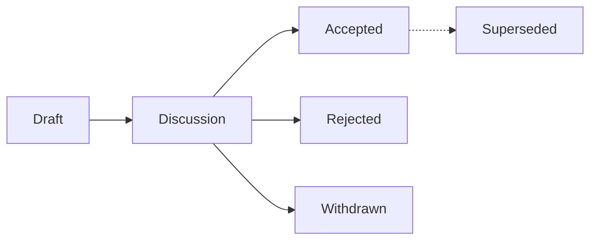

# Proposals (RRPs)

rrvix changes substantively through **RRPs** — *rrvix Proposals*. The RRP
process is modelled on IETF RFCs and Bitcoin BIPs: anyone can submit a
proposal, proposals get a stable number on first publication, and the
canonical text is immutable once accepted.

!!! warning "M0.6 — process being defined"
    The RRP process itself is being written as part of milestone M0.6. Until
    it lands, design discussions go through GitHub issues and PRs.

## When you need an RRP

You need an RRP for any of the following:

- A **breaking change to a JSON Schema** (anything that bumps the major version)
- A **new top-level field** in CIR or any schema
- A **substantive whitepaper revision** (typo fixes don't need one)
- A **change to the LaTeX class** that adds new semantic environments
- A **change to governance** — license, RRP process itself, code of conduct
- Any change to how **claim IDs**, **paper IDs**, or **annotation IDs** are minted

You do **not** need an RRP for:

- Bug fixes in non-spec code
- Documentation improvements
- Non-breaking schema additions (covered by minor version bumps)
- Tooling, CI, or build changes

## RRP lifecycle

## Index of RRPs

*(empty — first RRP will be RRP-0001, retroactively documenting the claim
graph design from the whitepaper)*
