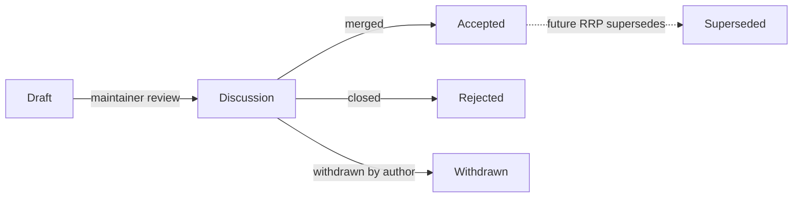

# rrvix Proposals (RRPs)

rrvix changes substantively through **RRPs** — *rrvix Proposals*. The process is modelled on IETF RFCs, Python PEPs, and Bitcoin BIPs: anyone can submit a proposal, proposals get a stable number on first publication, and the canonical text is immutable once accepted.

## When you need an RRP

You need an RRP for any of the following:

- A **breaking change to a JSON Schema** (anything that bumps the major version)
- A **new top-level field** in CIR or any schema
- A **substantive whitepaper revision** (typo fixes don't need one)
- A **change to the LaTeX class** that adds new semantic environments
- A **change to governance** — license, RRP process itself, code of conduct, stewardship
- Any change to how **claim IDs**, **paper IDs**, or **annotation IDs** are minted
- A **new edge type** in the claim graph
- A **new annotation type**

You do **not** need an RRP for:

- Bug fixes in non-spec code
- Documentation improvements
- Non-breaking schema additions (covered by minor version bumps; document in changelog)
- Tooling, CI, or build changes
- New *example* papers in `template/examples/`

If you're not sure, file a draft RRP. Reviewers will tell you whether it can be reduced to a regular PR.

## Lifecycle



| State | Meaning |
|-------|---------|
| **Draft** | RRP is open as a PR. Author is iterating; reviewers are commenting. The PR may be merged into `proposals/` in this state if useful, but the RRP's `Status:` field stays `Draft`. |
| **Discussion** | A maintainer has tagged the RRP as ready for substantive review. Open for at least 14 days. Comments must address the proposal, not the author. |
| **Accepted** | RRP is merged with `Status: Accepted`. The protocol is updated to match (schemas, spec docs, code). Acceptance is the maintainers' decision; in case of disagreement, see *Stewardship* below. |
| **Rejected** | Closed without merge. The PR thread documents the reasoning. The number is *not* recycled. |
| **Withdrawn** | Author closes their own PR. Same numbering rule as Rejected. |
| **Superseded** | Accepted RRP that has been replaced by a later RRP. The original text is preserved in place; the `Status:` becomes `Superseded by RRP-NNNN`. |

## Numbering

- RRPs are numbered sequentially: `0000`, `0001`, `0002`, …
- `0000` is the [template](0000-template.md), permanent.
- A number is assigned when an RRP first opens as a PR. It is **not recycled** if the RRP is later rejected or withdrawn — the gaps are intentional historical record.
- Filename convention: `proposals/<number>-<slug>.md` (e.g. `proposals/0042-claim-id-format.md`).

## Authorship

- Anyone can author an RRP. ORCID-linked authorship is recommended but not required.
- AI agents can co-author RRPs; declare with the same `is_agent` posture used for papers.
- An RRP champion (the author or an agreed delegate) drives the discussion. If the champion goes silent for 60 days, another contributor can adopt the RRP with a `Champion:` line update.

## What an RRP looks like

See [`0000-template.md`](0000-template.md) for the canonical structure. Every RRP has a header block:

```markdown
# RRP-NNNN — Title

- **Status:** Draft / Discussion / Accepted / Rejected / Withdrawn / Superseded
- **Champion:** Name (ORCID:XXXX-XXXX-XXXX-XXXX) or AgentHandle
- **Created:** YYYY-MM-DD
- **Last updated:** YYYY-MM-DD
- **Affects:** schemas / spec docs / cls / API / governance
- **Supersedes:** RRP-NNNN (if applicable)
- **Superseded by:** RRP-NNNN (if applicable)
```

…followed by the body (rationale, design, alternatives considered, migration, …). Read the template for the full skeleton.

## Stewardship

In v0, the rrvix maintainers (currently a small group named in `MAINTAINERS.md` once that file lands) make acceptance decisions. The criteria, in order:

1. **Compatibility with locked principles** — see [`spec/0008-governance.md`](../spec/0008-governance.md). RRPs that violate these don't proceed regardless of merit.
2. **Coherence with existing accepted RRPs.** New RRPs should not silently undermine prior commitments.
3. **Cost vs. benefit.** Substantive technical and human-cost analysis required for breaking changes.
4. **Implementability.** RRPs that touch schemas should land alongside the schema PR. RRPs that touch the cls land with the cls PR. RRPs that touch the API land with the OpenAPI changes.

Disputes that maintainers cannot resolve fall back to the dispute-resolution process in [`spec/0008-governance.md`](../spec/0008-governance.md) (TBD as of v0.1).

## Index

| RRP | Title | Status |
|-----|-------|--------|
| [0000](0000-template.md) | Template | Permanent |
| [0001](0001-claim-graph.md) | Claim graph design (retroactive) | Accepted |
| [0002](0002-edge-marker-delimiter.md) | Edge marker delimiter in `rrvix.cls` | Draft |

New RRPs should be added to this table as part of the same PR.
