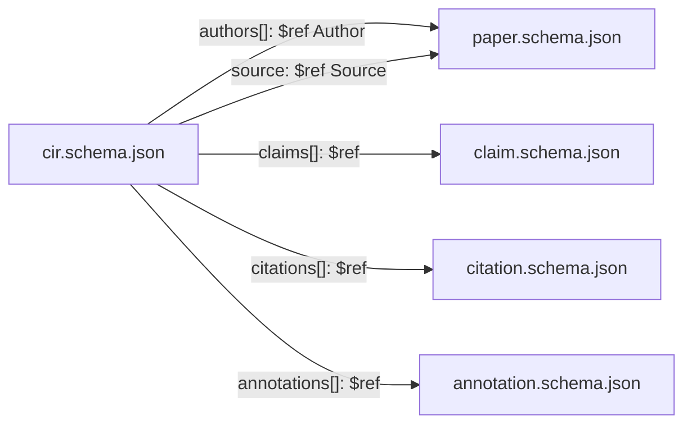

# rrvix schemas

JSON Schema 2020-12 definitions for the rrvix protocol data model.

## Files

| Schema                                        | Title                                  | $id                                                  |
| --------------------------------------------- | -------------------------------------- | ---------------------------------------------------- |
| [`cir.schema.json`](cir.schema.json)          | Canonical Intermediate Representation  | `https://rrvix.org/schema/v0/cir.schema.json`        |
| [`paper.schema.json`](paper.schema.json)      | Paper                                  | `https://rrvix.org/schema/v0/paper.schema.json`      |
| [`claim.schema.json`](claim.schema.json)      | Claim                                  | `https://rrvix.org/schema/v0/claim.schema.json`      |
| [`annotation.schema.json`](annotation.schema.json) | Annotation                          | `https://rrvix.org/schema/v0/annotation.schema.json` |
| [`citation.schema.json`](citation.schema.json) | Citation                               | `https://rrvix.org/schema/v0/citation.schema.json`   |

`cir.schema.json` references the standalone schemas via `$ref`. The standalone
schemas are independently usable for endpoints that return only one kind of
object (e.g. `GET /api/v0/papers/{id}` returns a Paper, `GET /api/v0/claims/{id}`
returns a Claim).

## Composition



`Author` and `Source` live as `$defs` inside `paper.schema.json` and are
referenced from CIR via `paper.schema.json#/$defs/Author` and
`paper.schema.json#/$defs/Source`. `Section` and `Figure` are CIR-internal and
remain inline `$defs` of `cir.schema.json`.

## Versioning

Schemas use semantic versioning at the schema level via the `version` field at
the top of each file. Breaking changes (removing a required field, narrowing
an enum, changing a type) require a major version bump and an RRP. Additive,
backwards-compatible changes are minor bumps.

The schema `$id` URL is namespaced by major version: `.../schema/v0/...`. The
v1 namespace is reserved for the first stable release.

## Validation

### Using ajv (Node.js)

```bash
cd tests/schemas
npm install
npm test
```

Or one-shot against an arbitrary JSON file:

```bash
npx ajv-cli@5 validate \
  -s schema/cir.schema.json \
  -r schema/paper.schema.json \
  -r schema/claim.schema.json \
  -r schema/annotation.schema.json \
  -r schema/citation.schema.json \
  --spec=draft2020 --strict=false \
  -c ajv-formats \
  -d path/to/your.cir.json
```

### Using python-jsonschema

```bash
python -m jsonschema --schema schema/cir.schema.json \
  --instance path/to/your.cir.json \
  --base-uri "$(realpath schema)/"
```
