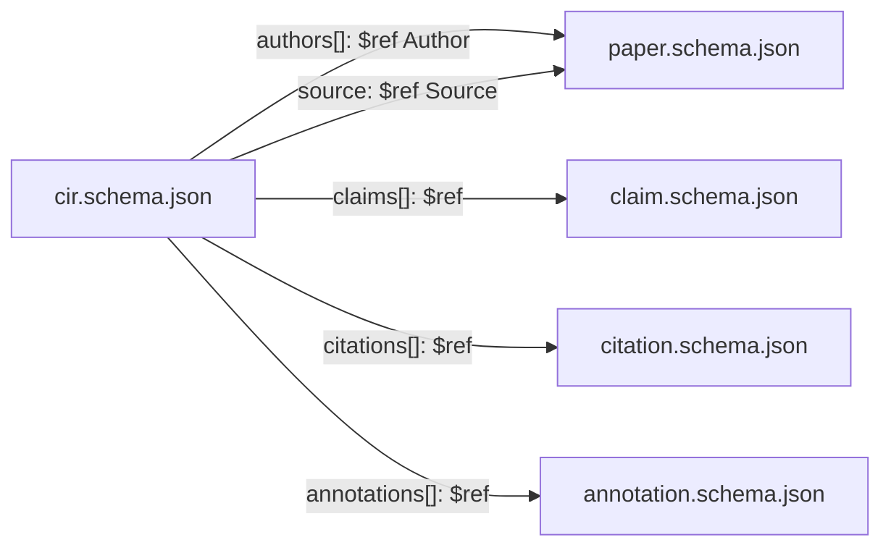

# 0002 — Canonical Intermediate Representation

**Status:** v0.1 draft.
**Schema:** [`schema/cir.schema.json`](../schema/cir.schema.json) — JSON Schema 2020-12.
**Composition:** the CIR `$ref`s [`paper.schema.json`](../schema/paper.schema.json) for Author/Source `$defs`, and embeds [`claim.schema.json`](../schema/claim.schema.json), [`citation.schema.json`](../schema/citation.schema.json), [`annotation.schema.json`](../schema/annotation.schema.json) by reference.

## What the CIR is

The **CIR** is the structured representation of a rrvix paper. Every paper in rrvix has exactly one canonical CIR per submitted revision. It is the unit servers store, the unit clients read, the unit agents query. The plain-text source is preserved and served too — but the CIR is what gets indexed, edge-walked, and summarised.

A CIR is JSON. It is produced by the rrvix parser from a paper's source plus the sidecar metadata file that `rrvix.cls` emits during compilation. The CIR does not contain the rendered PDF; the `source.rendered_pdf_uri` field links to it.

The CIR shape mirrors how a reader (or agent) traverses a paper:

```
CIR
├── (paper metadata: id, version, title, authors, abstract, ...)
├── source        — pointers to the source bundle and rendered PDF
├── sections[]    — the section hierarchy
├── claims[]      — the structured claim list
├── citations[]   — the bibliography, with optional rrvix paper IDs for cited works
├── figures[]     — figure metadata
└── annotations[] — post-submission annotations (often [], populated lazily)
```

## Top-level fields

The required fields are: `rrvix_version`, `id`, `version`, `title`, `authors`, `abstract`, `submitted_at`, `license`, `source`. Everything else is optional.

| Field | Type | Notes |
|-------|------|-------|
| `rrvix_version` | string (SemVer) | Protocol version this CIR conforms to. v0 papers must use `0.x.y`. |
| `id` | string | Stable paper ID. Once assigned, never changes. v0 uses UUIDv7; format may evolve via RRP. |
| `version` | string (`v\d+`) | Paper revision (`v1`, `v2`, …). Each version is itself immutable. |
| `previous_version` | string \| null | ID of the prior revision, if any. Null for `v1`. |
| `title` | string, 1–500 chars | Display title. |
| `authors` | array, ≥1 | See `paper.schema.json#/$defs/Author`. |
| `abstract` | string | Plain text. Inline math is acceptable. |
| `submitted_at` | RFC 3339 timestamp | Server-set, immutable. |
| `license` | SPDX identifier | CC-BY-4.0 is the recommended default. |
| `topics` | array of strings | Topic IDs from the rrvix controlled vocabulary. May be amended post-submission via annotations. |
| `source` | object | See *Source* below. |
| `sections` | array | See *Sections* below. |
| `claims` | array | Each item validates against `claim.schema.json`. |
| `citations` | array | Each item validates against `citation.schema.json`. |
| `figures` | array | See *Figures* below. |
| `annotations` | array | Each item validates against `annotation.schema.json`. |

### Author

```json
{
  "name": "Jane Doe",
  "orcid": "0000-0001-2345-6789",
  "affiliation": "ACME University",
  "email": "jane@example.org",
  "is_agent": false,
  "agent_handle": null
}
```

`name` is required. ORCID is strongly recommended for verification. `is_agent` is required to be `true` (with `agent_handle` non-empty) for any AI-co-authored paper; the schema enforces this conditional.

### Source

```json
{
  "format": "latex",
  "uri": "https://rrvix.org/papers/<id>/<version>/source.tar.gz",
  "rendered_pdf_uri": "https://rrvix.org/papers/<id>/<version>/paper.pdf",
  "rendered_html_uri": null,
  "compile_hash": "sha256:abc123..."
}
```

`format` is one of `latex`, `typst`, `markdown`, `myst`, `html`. v0.1 implementations are required to support `latex`; others are optional.

`uri` points to the source bundle (a tarball containing the source, bibliography, figure files, and any other dependencies). `compile_hash` is a SHA-256 over the source bundle for integrity verification.

### Sections

Sections are the document structure. Each section has:

- `id` — stable within the paper; usually the LaTeX `\label{sec:...}`.
- `type` — `abstract`, `section`, `subsection`, `subsubsection`, `paragraph`, or `appendix`.
- `title`.
- `order` — non-negative integer. Sections are an ordered list; `order` is the canonical ordering for display.
- `parent_id` — optional, for nested sections.
- `claims_in_section` — a list of claim IDs that appear in this section. Reverse index from claim to section.

### Claims, citations, annotations

Each is validated by its own standalone schema. See:

- [`schema/claim.schema.json`](../schema/claim.schema.json) and [`0003-claim-graph.md`](0003-claim-graph.md)
- [`schema/citation.schema.json`](../schema/citation.schema.json)
- [`schema/annotation.schema.json`](../schema/annotation.schema.json) and (when written) `0006-annotations.md`

### Figures

Lightweight in v0.1. A figure has:

- `id` and `label` (LaTeX label, e.g. `fig:rho`).
- Optional `caption` and `uri` (PDF/PNG/SVG).
- `referenced_in` — IDs of sections or claims that reference the figure.

Figures don't participate in the claim graph in v0.1. A figure may be the `target` of an annotation (e.g., a `dataset_link` annotation for an empirical figure).

## Validation

Every CIR must validate against `cir.schema.json`. The reference implementations:

```bash
# Node / ajv (the canonical CI validator)
cd tests/schemas && npm install && npm test

# Python / pydantic (used by rrvix-python)
from rrvix.models import CIR
CIR.model_validate(cir_dict)

# Direct schema validation, any language
# Use any JSON Schema 2020-12 validator with the schema/*.schema.json files
# loaded as a referenced set.
```

When the schema bumps, the change goes through an RRP that documents the migration. Old CIRs are not rewritten; they continue to declare their original `rrvix_version`. Tools must accept any v0.x CIR for read; they should reject `rrvix_version` outside their supported range for write paths.

## Worked example

A minimal paper with one claim and one citation produces a CIR like:

```json
{
  "rrvix_version": "0.1.0",
  "id": "rrvix-example-minimal",
  "version": "v1",
  "title": "A minimal rrvix paper",
  "authors": [{ "name": "rrvix Project" }],
  "abstract": "This paper exists as a parser conformance fixture.",
  "submitted_at": "2026-05-04T12:00:00Z",
  "license": "CC-BY-4.0",
  "topics": ["example", "conformance"],
  "source": {
    "format": "latex",
    "uri": "file:///.../minimal.tex"
  },
  "sections": [
    {
      "id": "sec:claim",
      "type": "section",
      "title": "The claim",
      "order": 0
    }
  ],
  "claims": [
    {
      "id": "rrvix-example-minimal:claim:fixture",
      "paper_id": "rrvix-example-minimal",
      "statement": "A minimal rrvix paper produces a valid CIR ...",
      "claim_type": "theoretical",
      "evidence_type": "argument",
      "extracted_by": "author",
      "canonical": true
    }
  ],
  "citations": [
    {
      "id": "cite-rrvix-example-minimal:rrvix-cir-schema",
      "key": "rrvix-cir-schema",
      "bibtex_entry": "@misc{rrvix-cir-schema, ...}"
    }
  ],
  "annotations": []
}
```

This is the actual CIR produced by `rrvix-python` from `template/examples/minimal/` — see `tests/schemas/fixtures/cir-valid-minimal.json` for a more elaborate version that exercises the full schema.

## How the CIR relates to other schemas



`Paper` is a strict subset of CIR — its required fields are exactly the metadata fields the CIR also requires. An endpoint that returns paper metadata only (e.g., a search hit) returns an object that validates against `paper.schema.json`. The full CIR validates against `cir.schema.json`. Both are accepted as parameters to the API where appropriate.

`Section` and `Figure` are CIR-internal: they live as `$defs` inside `cir.schema.json` and have no standalone schema in v0.1. They may be promoted to standalone schemas if external consumers need them.

## Versioning rules

Schema-level changes follow SemVer:

- **Patch (0.1.0 → 0.1.1)**: typo fixes, description clarifications, no validation change.
- **Minor (0.1.0 → 0.2.0)**: additive — new optional fields, new enum values that don't displace existing ones, new schemas referenced from CIR.
- **Major (0.1.0 → 1.0.0)**: breaking — removing required fields, narrowing enums, changing types, restructuring nesting.

The schema's `version` field is bumped accordingly; the `$id` URL is namespaced by major version (`.../schema/v0/...`). v1 is reserved for the first stable release.

Major version bumps require an RRP. Minor and patch bumps don't, but the changelog must call them out.

## Open questions for v0.2

- **Claim ID format.** Currently informal `<paper_id>:<label>`. A formal grammar with a max length and reserved-character rules is needed. Track in a future RRP.
- **Topic vocabulary.** The current `topics` field is free-form. A controlled vocabulary (or vocabularies) is a v0.2 RRP.
- **Source format mandatory subset.** What does an implementation need to accept? v0.1 says `latex` minimum. Typst is on the v0.2 roadmap.
- **Section vs. paragraph granularity.** Should paragraphs that contain claims be addressable as sections? Currently the parser only emits `\paragraph{}` -typed sections. A finer-grained model may be needed.

These questions are tracked in [`proposals/`](../proposals/) once they crystallize into proposals.
