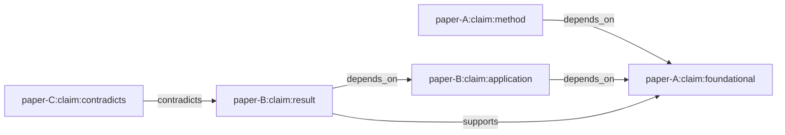
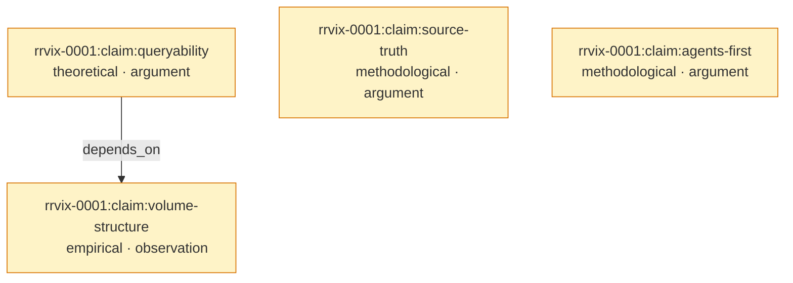

# 0003 — Claim graph

**Status:** v0.1 draft.
**Schema:** [`schema/claim.schema.json`](../schema/claim.schema.json).
**Prereqs:** [`0001-overview.md`](0001-overview.md), [`0002-cir.md`](0002-cir.md).

## What the claim graph is

The **claim graph** is the corpus-spanning directed graph whose nodes are claims and whose edges are typed relationships between claims. It is *the* central data structure rrvix exposes that the existing preprint stack does not.

Edges are typed. The four edge types in v0.1 are `depends_on`, `supports`, `contradicts`, `extends`. They are intentionally few; new edge types must clear an RRP because the graph's semantics depend on the edge taxonomy being stable.

## What a claim is

A claim is a **single falsifiable assertion** with a stable ID. The full schema is in [`claim.schema.json`](../schema/claim.schema.json); the load-bearing fields are:

- **`id`** — globally unique. The convention is `<paper_id>:<local_label>` (e.g. `rrvix-0001:claim:queryability`). The `id` of a claim never changes.
- **`statement`** — the assertion in plain language. Should be standalone-readable. *"A claim graph with explicit `supports`/`depends_on`/`contradicts` edges is queryable in ways an unstructured PDF corpus is not"* is a well-formed claim. *"This is true"* is not.
- **`claim_type`** — `empirical`, `theoretical`, `definitional`, `methodological`, `computational`. The taxonomy is derived from how research claims actually decompose; see [the whitepaper §3.2](../whitepaper/rrvix-whitepaper.tex) for the rationale.
- **`evidence_type`** — `proof`, `experiment`, `simulation`, `observation`, `argument`, `definition`, `convention`. Orthogonal to `claim_type`: a `theoretical` claim can be supported by a `proof` or by an `argument`.
- **`scope`** — the regime the claim is asserted to hold in: `models`, `datasets`, `regimes`, `assumptions`. A claim about LLM scaling holding "in the dense-attention regime" is meaningfully different from the same statement without that scope.
- **`replication_status`** — server-derived, one of `untested`, `partial`, `replicated`, `contradicted`, `retracted`. Updated when annotations land.
- **`extracted_by`** — `author`, `agent`, or `annotator`. Tracks provenance.
- **`canonical`** — boolean. True iff confirmed by the paper's author (or by quorum of credentialed annotators for older papers).

A claim's `paper_id` field links it back to the paper. A claim cannot exist outside a paper: the canonical-citation model requires every claim to have an immutable provenance.

## Edge types

### `depends_on`

> Claim X **depends on** claim Y if X's argument relies on Y being true.

`depends_on` is the strongest edge. It is the structural backbone of the graph for derivation chains.

When a paper `\cite{}`s another paper to invoke a result, that's *usually* a `depends_on` relationship at the claim level — but the cite-key alone doesn't identify *which* claim of the cited paper is being invoked. Authors who care about claim-level dependencies declare them explicitly in `rrvix.cls` via `\dependson{<source>}{<target>}`.

`depends_on` cycles are forbidden. The reference parser warns on cycles in the within-paper subgraph. Cross-paper cycles can happen via mistakes (paper A depends on B which depends on A); they're flagged on submission of the second paper but not blocking, on the assumption that they're usually clerical errors that get fixed by erratum.

### `supports`

> Claim X **supports** claim Y if X is presented as evidence for Y.

`supports` is the inverse-ish of `depends_on` but not identical. `supports` is about the rhetorical role within a paper or across papers ("X is the evidence I'm offering for Y"). `depends_on` is about the logical structure ("Y's argument requires X").

A single replication paper that re-runs an experiment from another paper has `supports` from the new paper's empirical claim to the original paper's empirical claim. The replication is *evidence for* the original; it doesn't depend on the original being true.

### `contradicts`

> Claim X **contradicts** claim Y if X and Y cannot both be true within their stated scopes.

This is the most consequential edge. `contradicts` is the structure that makes the corpus self-correcting. Three rules:

1. **Authors can declare `contradicts` on their own claims.** Saying "this paper contradicts result R from prior paper P" is a normal, productive academic move. It declares an edge.
2. **Annotators can also declare `contradicts`.** A reader notices that paper A's claim and paper B's claim are mutually exclusive given a shared assumption. They submit a `contradiction` annotation. This creates an edge owned by the annotation, not by either paper.
3. **The contradiction is a claim about a claim.** Disputes over whether two claims actually contradict are themselves annotations. A claim can be `disputed_by` annotators who think the contradiction edge is mistaken.

`contradicts` edges are **not transitive**: if X `contradicts` Y and Y `contradicts` Z, that does not imply X `supports` Z. The semantics of contradiction depend on the claims' scopes, which can differ.

### `extends`

> Claim X **extends** claim Y if X generalizes, refines, or strengthens Y.

A theorem with weaker assumptions extends the original. An empirical study at larger N extends the original. A method that subsumes a prior method extends it. `extends` is a recognition edge — it acknowledges intellectual lineage without contradicting.

## Edge declaration

Edges are declared in two places:

1. **By authors, in the paper source.** The `rrvix.cls` macros `\dependson{S}{T}`, `\supports{S}{T}`, `\extendsclaim{S}{T}`, `\contradicts{S}{T}` emit edge markers in the sidecar that the parser turns into edges. See [`0004-tex-template.md`](0004-tex-template.md).
2. **By annotators, after submission.** A `contradiction` or `extension` annotation creates the corresponding edge. The annotation is signed; the edge inherits provenance from the annotation.

In both cases, the edge has a `source` and `target` claim ID. The IDs may belong to claims in different papers (cross-paper edges are first-class).

## Claim graph properties relied on by queries

Most rrvix queries assume:

- **Claim IDs are globally unique** and never change once assigned. This is the contract that lets edges be stable.
- **Claims are immutable.** An "updated" claim is a *new* claim with a new ID, with an `extends` edge from the new claim to the old. The old claim's `replication_status` may evolve, but its `statement` and `scope` do not.
- **The graph is finite at any moment but unbounded over time.** Servers should support efficient k-hop traversal; v0.1 doesn't specify performance bounds, but the API design (see future `0007-api.md`) anticipates a graph database under the hood.

Cycles in `depends_on` are a soft error (see above). Cycles in `extends` are forbidden by construction (extending is about generalization; if X extends Y and Y extends X, by definition they are the same claim). Cycles in `supports` and `contradicts` are not forbidden but are unusual; they're flagged for review.

## Worked example: the whitepaper's claim graph

The rrvix whitepaper itself is a paper in rrvix. Its CIR has 4 claims and 1 explicit edge:

Read: the queryability claim is built on the empirical observation that the corpus has outgrown human-only readers. The other claims (source-of-truth and agents-as-first-class) stand alone as design assertions. None are replicated yet (they're recent), so all carry `replication_status: untested`.

This is the smallest non-trivial claim graph in rrvix. As papers cite the whitepaper and extract claims of their own, the graph grows outward — `extends` edges from new methodological claims, `supports` edges from any replication studies of `volume-structure`, and so on.

## Server-derived fields

Two claim fields are computed by the server from annotations, not declared by authors:

- **`replication_status`** — aggregated from `replication` annotations targeting the claim. Aggregation rules are TBD in a future RRP; v0.1 defaults to `untested` until at least one replication annotation lands.
- **`labels`** — free-form labels (`load-bearing`, `speculative`, `background`, etc.) that the server can derive from edge structure. *"Load-bearing"* might mean "≥5 other claims `depend_on` this one"; the exact thresholds are TBD.

Authors *can* set initial `labels` in the source; servers may override based on graph structure.

## What the graph does NOT model in v0.1

- **Author trust networks.** Authors don't endorse other authors directly. Provenance is per-annotation, not per-author-graph.
- **Citation context.** A `\cite{}` call doesn't automatically create a `depends_on` edge — it's just a reference. Authors who want to declare claim-level dependencies must do so explicitly via `\dependson{}`.
- **Numeric weights on edges.** Every edge is binary (it exists or doesn't). Weighted edges (e.g., "this depends 80% on that") add complexity without an obvious payoff in v0; revisit if a use case demands it.
- **Time-varying truth.** A claim doesn't become "false" over time; new evidence creates new annotations or new claims that extend/contradict. The claim itself is immutable.

## Open questions for v0.2

- **Edge declaration ergonomics in source.** The current `\dependson{src}{dst}` requires explicit IDs, which is verbose. A `[depends-on=other-paper:claim:foo]` argument on `\begin{claim}` would be cleaner.
- **Edge format ambiguity.** The v0.1 sidecar uses `:` to join edge fields, but `:` also appears within claim IDs. The parser uses a midpoint-split heuristic that works for canonical IDs but fails on degenerate cases. A non-`:` separator in the cls is an obvious fix; track via RRP.
- **Graph query language.** v0.1 ships with no specified query language. The API will expose primitive walks (`/claims/{id}/depends-on?depth=2`). Whether to adopt Cypher / GraphQL / SPARQL or a bespoke DSL is a Phase-1 RRP.
- **Cross-paper edge integrity.** What happens when a paper claims `depends_on` an external claim ID that doesn't exist? v0.1: edge is preserved but flagged. A v0.2 RRP should specify resolution (lazy verification at query time vs. eager rejection at submission).

These questions are tracked in [`proposals/`](../proposals/) once they crystallise.
